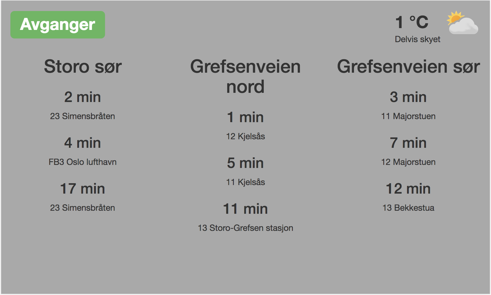

# pidash

Pidash is a dashboard which currently can display transit information from the Ruter api (https://ruter.no/labs/) and weather from Yr (http://om.yr.no/info/verdata/). Written in Go and Elm.

The UI is optimized to be displayed in a [Raspberry Pi 7" touch display](https://www.raspberrypi.org/products/raspberry-pi-touch-display/) which is 800x400.

## How to use

1. Download the binary for your platform from the [releases page](https://github.com/ringvold/pidash/releases) (or build form source for other platforms)
2. Configure the transit stops to display departures for in `pidash.yml`. See "["How to find stop and quay ids for the Entur API"](https://github.com/ringvold/pidash/wiki/How-to-find-stop-and-quay-ids-for-the-Entur-API) for more information.
3. Put `pidash.yml` it in the same folder as the binary. See `pidash.yml.sample` for config example
4. Run the binary: `./pidash`
5. Open http://localhost:8081 in a browser

## Motivation

I have for a long time wanted to have some kind of dashboard that can show relevant information like transit information, weather, calendar and others so I created this project. The project is also an outlet for working with other programming languages.

I use this dashboard with my Raspberry Pi 3 and [Raspberry Pi Touch Display](https://www.raspberrypi.org/products/raspberry-pi-touch-display/) in a [Smart Pi Touch case](https://www.adafruit.com/product/3187).

If others can get some use out of this project, as-is or with some modding, I'll be very glad. :) Let me know if you enjoy it or would like some ajustments or features.

## Todo
- Add documentation on how to find stop and quay id from Entur API
